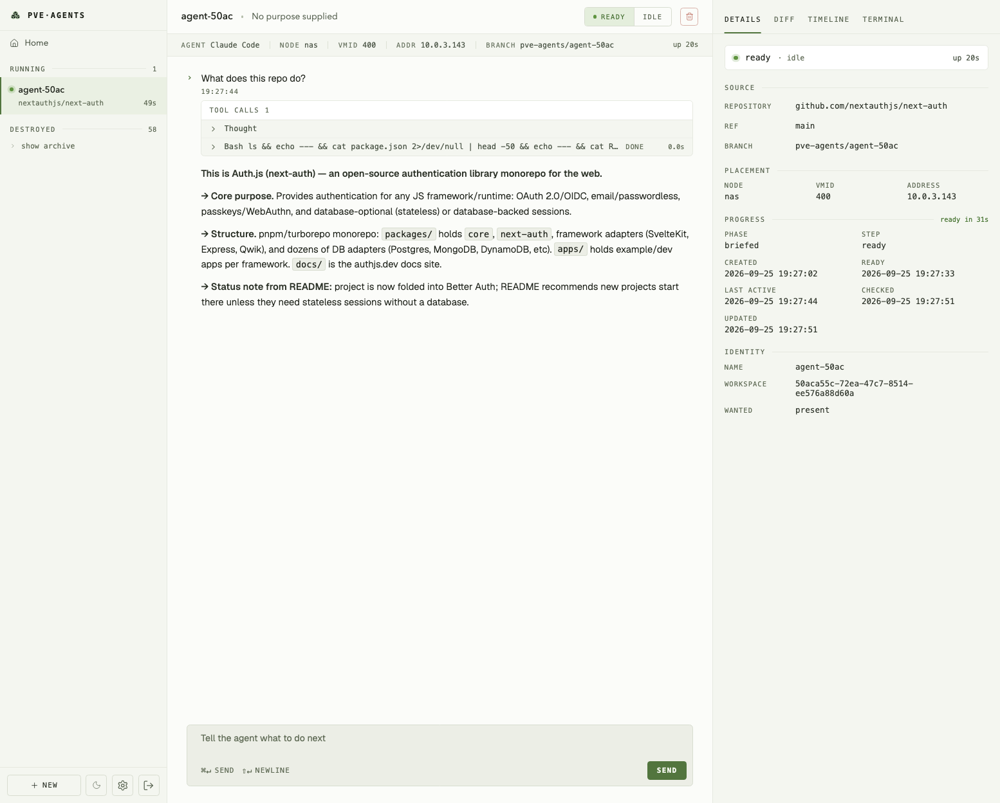

<h1>
  
  pve-agents
</h1>

Disposable coding agents on your own Proxmox host.

Give it a repository, a ref, and a purpose. It clones a golden template, boots an LXC, checks the
repository out, starts your selected agent inside it and hands it the purpose. The web UI streams
that agent's transcript, takes prompts, answers its permission dialogs, shows what it changed, and
pushes or discards the result. When a workspace has outlived its usefulness the controller destroys
it — unless it is holding work nobody kept.

The controller owns the lifecycle, the policy and the UI. Proxmox owns the containers. Your agent
owns the actual work.



## ✨ What it does

- **Start work from a sentence** — a repository, a ref and a purpose become a booted container with
  an agent already working in it. No step in between is yours.
- **Watch the agent think** — the transcript streams over SSE, tool calls and all, replayed from
  the beginning for whoever opens the page late.
- **Answer its questions** — permission prompts surface in the browser and are answered there,
  rather than in a terminal somebody has to already be attached to.
- **Read what changed** — per-file diffs in the rail, then push to `pve-agents/<hostname>` or
  discard the lot.
- **Drop into a real shell** — a full terminal into the workspace over `ghostty-web`, for the
  things a transcript cannot do.
- **Forget about cleanup** — idle workspaces are reaped automatically, and a workspace holding
  uncommitted or unpushed work is exempt until you deal with it.
- **Keep Proxmox honest** — containers the controller no longer recognises are reported, never
  destroyed. A restored database does not cost you your fleet.
- **Lock it down** — GitHub sign-in for the UI, hashed API keys for machines.

## ⚡ Quick start

```bash
pnpm install
cp .env.example .env
pnpm dev                   # http://127.0.0.1:3000
```

State lands in `./data/controller.db`. `CONTROLLER_HOST` and `CONTROLLER_PORT` move the listener.

**Nothing touches Proxmox until you ask it to.** `PROVISIONING_ENABLED` is off by default, and with
it off a request queues a durable operation and builds nothing. That is the intended way to try the
UI, the API and the whole state machine without a hypervisor anywhere near it.

## 🏗️ Requirements

To go past the queue and build real containers:

- Node 22+ and pnpm
- A Proxmox host with an API token, a pool, and a template built by
  [`deploy/build-workspace-template.sh`](deploy/build-workspace-template.sh)
- A GitHub App, for cloning and pushing as an installation rather than as you
- Authentication for your agents of choice (i.e. claude-code or anything in
  opencode)

## 🏔️ Environment

Copy `.env.example` to `.env`. Thirty variables, of which these decide whether anything happens:

| | |
|---|---|
| `CONTROLLER_AUTH_SECRET` | Turns authentication on. **Unset means the controller answers anyone who can reach it.** Set it. |
| `PROVISIONING_ENABLED` | Gates every Proxmox write. Off by default. |
| `PROXMOX_*` | URL, token, node, pool, template VMID, bridge, VMID floor. |
| `GITHUB_APP_*` | Id, installation id and key path. How the controller clones and pushes. Distinct from `GITHUB_CLIENT_*`, which is only how you sign in. |
| `WORKSPACE_CLAUDE_OAUTH_TOKEN` | From `claude setup-token`. Without it a workspace builds and the agent step fails. |
| `WORKER_ENABLED` | Runs the operation worker in the server process. Off by default, so the first clone and destroy can be stepped by hand with `pnpm worker:tick`. |

[`docs/production-runbook.md`](docs/production-runbook.md) has the rest.

## 🚀 Deploying

```bash
./bin/deploy.sh              # deploy
./bin/deploy.sh --dry-run    # show what would be sent and removed, change nothing
```

Not by hand. The controller's checkout is an rsync target rather than a git clone, and several
steps fail silently when skipped — the runbook says which.

## 🛡️ What it will not do

Destruction is the only path that loses something irreversibly, so it is the one with the most said
about it.

- **Only the ownership marker authorises it.** Every container carries the controller's id, the
  workspace id and a token in its LXC description, re-read immediately before anything is purged.
  Pool membership, hostname and tags are discovery aids, not permission.
- **Unsaved work is kept.** Uncommitted changes or unpushed commits exempt a workspace from reaping,
  and so does a workspace the controller could not inspect. "Could not tell" is not "nothing to
  lose".
- **Unrecognised containers are reported, never destroyed.** A restored or lost database makes every
  live workspace look orphaned, and a timer would then purge the fleet.

## 📚 Documentation

**[pve-agents.sh](https://pve-agents.sh)** is the full documentation: setup, concepts, operations,
reference and troubleshooting, with search. Start at
[Proxmox setup](https://pve-agents.sh/docs/getting-started/proxmox-setup) to get from a bare
hypervisor to a template you can clone.

| | |
|---|---|
| [`AGENTS.md`](AGENTS.md) | Start here to work on the code. Conventions, and the rules this codebase learned the hard way. |
| [`docs/architecture.md`](docs/architecture.md) | The system as built, including where an earlier intention was abandoned and why. |
| [`docs/http-api.md`](docs/http-api.md) | The HTTP API, for scripting the controller. |
| [`docs/seed-files.md`](docs/seed-files.md) | Files every workspace is built with, and how MCP servers reach one. |
| [`docs/production-runbook.md`](docs/production-runbook.md) | Deploying and operating it. |
| [`docs/proxmox-lifecycle.md`](docs/proxmox-lifecycle.md) | Clone, boot, address, destroy, and reconcile. |
| [`docs/security-and-networking.md`](docs/security-and-networking.md) | Network shape, credentials, and what is deliberately not trusted. |

## 🧑‍💻 Development

```bash
pnpm check && pnpm typecheck && pnpm test && pnpm build
```

None of those load a page. After anything touching routing or SSR, open the site and look at it.

## 🤖 Acknowledgements

This project was developed with significant assistance from LLMs. Architecture decisions,
implementation and documentation were all shaped through human-AI collaboration.

## 📝 License

[AGPL-3.0](LICENSE)
